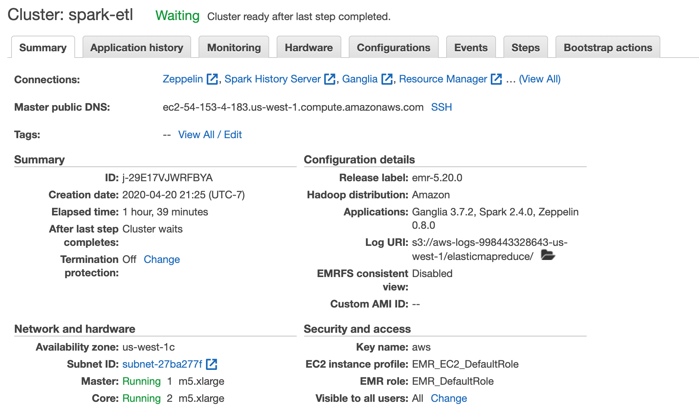
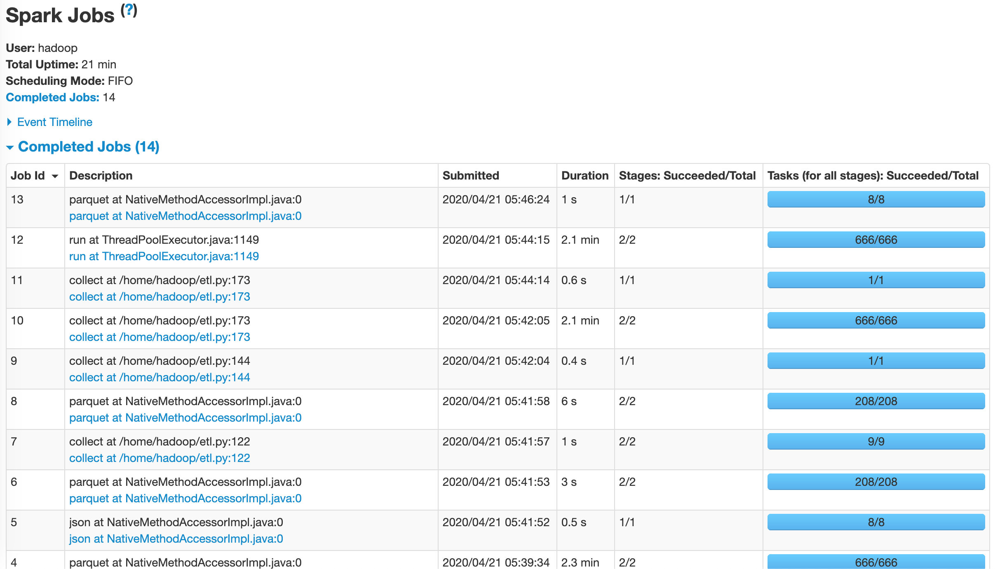
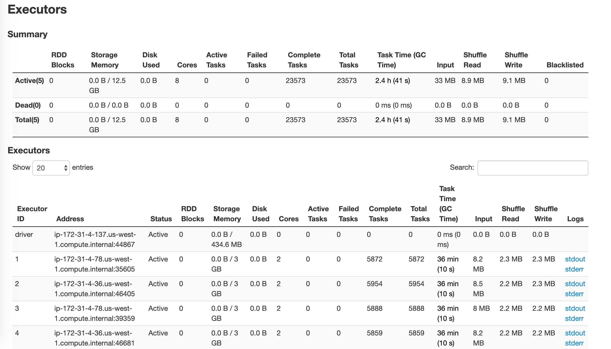
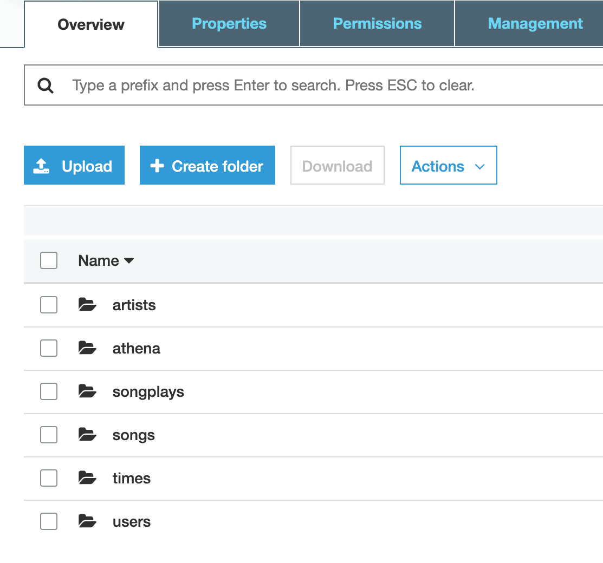
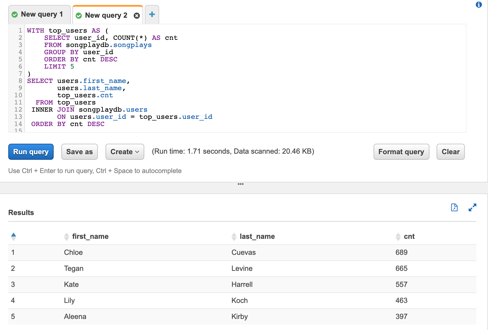
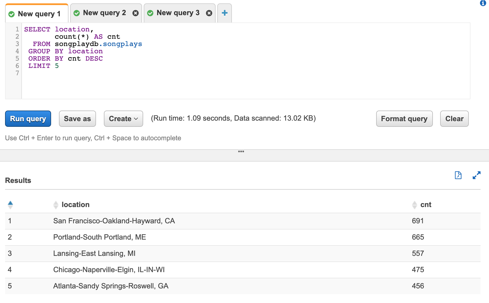

# Spark Data Lake with AWS EMR and AWS Athena

In this project, I implement a datalake using S3 and AWS Elastic MapReduce (EMR). Later, the data loaded is analyzed using AWS Athena. 

In this project, I demonstrated how we can migrate data from data-warehouse to a data lake. The source data resides in S3, in a directory of JSON logs. An ETL pipeline is built that extracts the data from S3, processes them using Spark, and loads the data back into S3 as a set of dimensional tables. The Spark jobs are deployed on AWS EMR cluster and later analyzed using AWS Athena (FaaS). 

Two datasets are used:
1. A song dataset, which is a subset of real data (s3://udacity-dend/song_data).
A single song file looks like:
> {"num_songs": 1, "artist_id": "ARJIE2Y1187B994AB7", "artist_latitude": null, "artist_longitude": null, "artist_location": "", "artist_name": "Line Renaud", "song_id": "SOUPIRU12A6D4FA1E1", "title": "Der Kleine Dompfaff", "duration": 152.92036, "year": 0}

2. A log dataset, which consists of log files in JSON format based on the songs in the dataset above (s3://udacity-dend/log_data).
A log file looks like:

The files are stored in S3 bucket `s3a://udacity-dend` and are ingested into fact and dimension tables that are written as parquet file at location `s3://sparkify-data-lake-sudip/`

Fact Table:
1. songplays -records in event data associated with song plays i.e. records with page NextSong
> songplay_id, start_time, user_id, level, song_id, artist_id, session_id, location, user_agent

Dimension Tables:
1. users - users in the app
> user_id, first_name, last_name, gender, level

2. songs - songs in music database
> song_id, title, artist_id, year, duration

3. artists - artists in music database
> artist_id, name, location, lattitude, longitude

4. time - timestamps of records in songplays broken down into specific units
> start_time, hour, day, week, month, year, weekday

The project consists of the following files:
- etl.py: A Spark python script that runs the extraction and transformation pipeline
- emr_functionality.py: A utility script to manage EMR ressources, create cluster, submit steps, and query for steps status.
- dl.cfg: the AWS credentials and region to use
- emr.cfg: The configuration parameters used to create an EMR cluster using the script emr.py

##  Running The Pipeline in EMR

1. Insert the AWS account credentials into the dl.cfg file. Also, you can change the BUCKET_NAME (if required). Moreover, the AWS EMR details can be changed present in the emr.cfg file.

2. To create the EMR cluster and run one instance of the etl.py pipeline, run: 

> python emr_functionality.py --cmd create-cluster

This command will create the cluster.

3. Find the hostname for the master node, scp the etl.py file to the master node, and initiate an EMR step that runs the Pipeline from within the master node.

This command copies etl.py to MASTER node only
> python emr_functionality.py --cmd setup-etl

On the other hand, following command copies etl.py file to any available node in the cluster
> python emr_functionality.py --cmd submit-job

4. To check the status of the clusters, run:

> python emr_functionality.py --cmd describe-clusters

you can also login into AWS EMR console and verify the cluster is in the RUNNING or WAITING mode:

5. You can also verify that the ETL pipeline is running by listing the steps in the cluster:

> python emr_functionality.py --cmd list_clusters_steps

The job should also appear in the Spark History Server UI:

We can also look at the list of the Spark executors:

### Output

The final tables will be stored as folders in S3 buckets defined in etl.py.

The files format is parquet, using snappy compression.

## Analysis with Amazon Athena

After running the pipeline, we can do some analysis by ingesting the S3 data using [Amazon Athena](https://aws.amazon.com/athena/)

First, setup a Glue crawler that points to the bucket folder where the generated tables files are stored. The crawler will automatically extract the tables from the parquet files.

After a few minutes, tables will show up in the Athena console under `Query Editor`:

We can run a query to generate the top 5 most active listeners on the platform using the following query:

~~~ sql
WITH top_users AS (
    SELECT user_id, COUNT(*) AS count
    FROM songplay
    GROUP BY user_id
    ORDER BY cnt DESC
    LIMIT 5
)
SELECT users.first_name, 
       users.last_name, 
       top_users.cnt
  FROM top_users
 INNER JOIN users
       ON users.user_id = top_users.user_id
 ORDER BY cnt DESC
~~~~

and we get:

| first_name | last_name | cnt |
| ------------- |:-------------:|:-------------:|
| Chloe | Cuevas | 689 |
| Tegan | Levine | 665 |
| Kate | Harrell | 557 |
| Lily | Koch | 463 | 
| Aleena | Kirby | 397 |

See the results in Athena:

We can also look for the top 5 most popular locations where songs are played, using the following query:

~~~ sql
SELECT location, 
       count(*) AS cnt 
  FROM songplay
 GROUP BY location 
 ORDER BY cnt DESC 
 LIMIT 5
~~~~

| location | count |
| ------------- |:-------------:|
| San Francisco-Oakland-Hayward, CA | 691
| Portland-South Portland, ME | 665
| Lansing-East Lansing, MI | 557
| Chicago-Naperville-Elgin, IL-IN-WI | 475
| Atlanta-Sandy Springs-Roswell, GA | 456

See the results in Athena:

